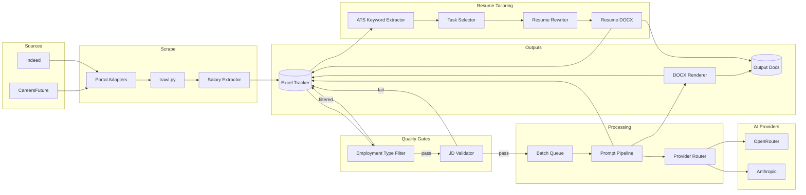
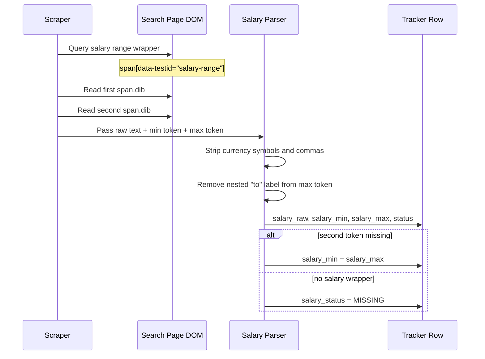
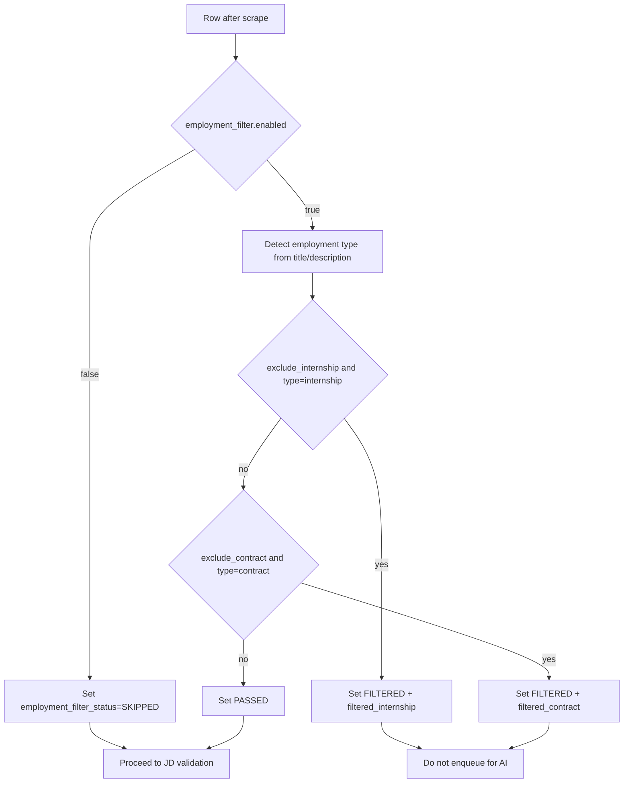
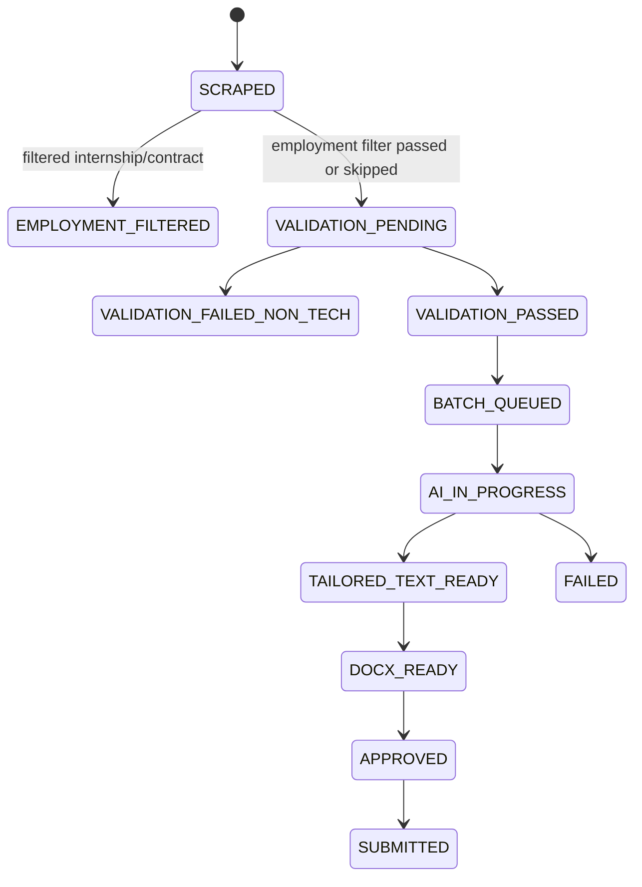
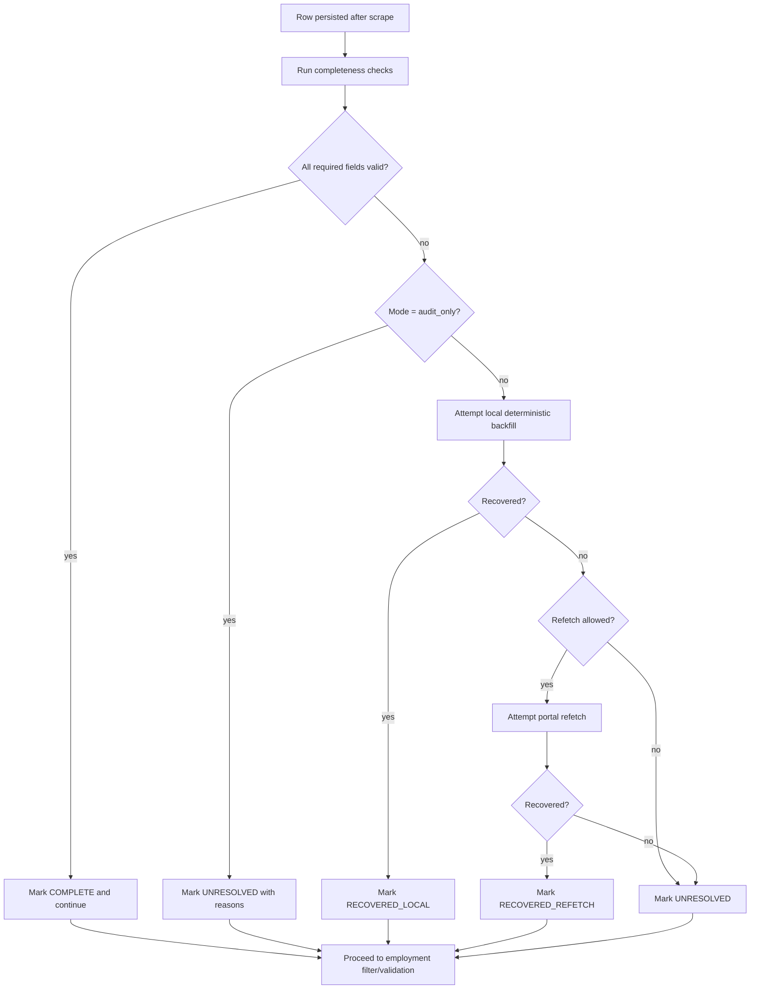
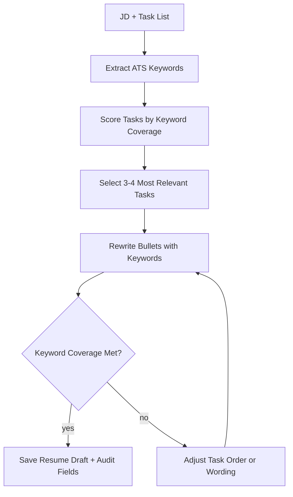
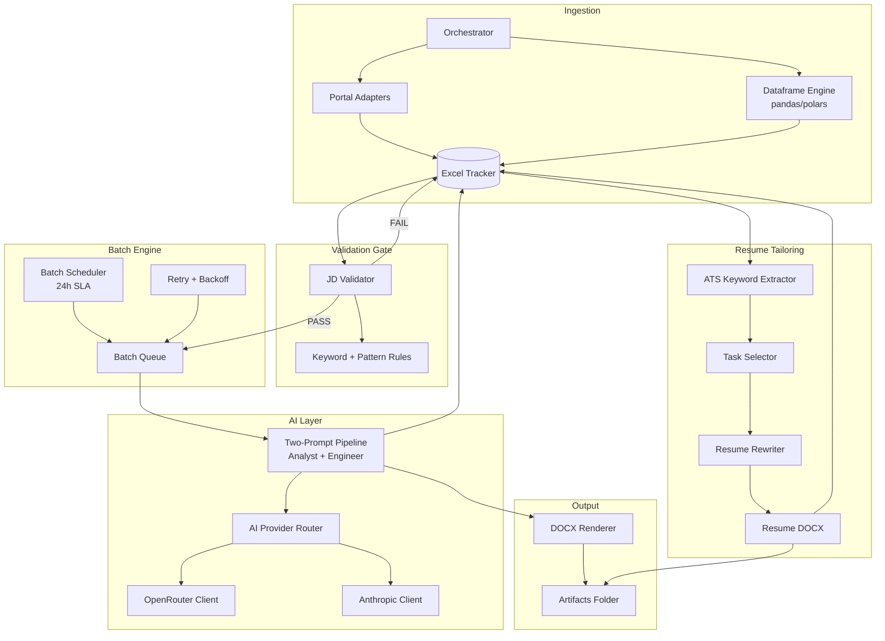

# Architecture Design: Job Application Automation (Updated)

## 1. Goals of This Update

This architecture revision introduces ten capabilities:

1. Salary extraction with explicit selector-driven parsing for CareersFuture.
2. Toggleable employment-type filtering for internship and contract roles.
3. Automatic pass/fail validation for technical relevance before AI tailoring.
4. Slow, controlled batch processing with a 24-hour service-level target.
5. AI provider abstraction for OpenRouter and Claude with budget controls.
6. Two prompt layers for role-specific curation (Data Analyst and Data Engineer).
7. Downstream output generation in DOCX format.
8. Initial data completeness audit with optional deterministic backfill.
9. Dataframe engine migration path from pandas to Polars with parity guardrails.
10. ATS-style resume tailoring agents that extract keywords, select tasks, and produce a resume draft.

## 2. Diagram-First Architecture Plan

### 2.1 End-to-End System Context



### 2.2 Salary Extraction Sequence (CareersFuture)



### 2.3 Employment Filter Decision Flow



### 2.4 Processing and State Transitions



### 2.5 Data Completeness Decision Flow



### 2.6 Resume Tailoring Flow (ATS-Style)



## 3. High-Level Target Architecture



## 4. Runtime Pipeline and States

### 4.1 End-to-End Flow

1. Scrape listing and description using existing adapters.
2. Persist raw row to Excel with initial state `SCRAPED`.
3. Run data completeness checker (`audit_only` or `recover` mode).
4. Run employment-type filter stage (if enabled).
5. Run JD Validator gate using role profile derived per row.
6. If failed, mark row `VALIDATION_FAILED_NON_TECH` and skip AI.
7. If passed, enqueue row into batch queue for role-specific prompt processing.
8. Execute two-prompt pipeline for selected role stream.
9. Save tailored text in tracker and render DOCX artifact.
10. Extract ATS keywords from JD text and score task list coverage.
11. Select 3-4 tasks and rewrite resume bullets with verified keywords.
12. Save resume draft path and audit metadata in tracker.
13. Mark row `DOCX_READY` only after post-write validation succeeds.

### 4.2 Tracker State Model (Extended)

Recommended status lifecycle:

- `SCRAPED`
- `VALIDATION_PENDING`
- `VALIDATION_FAILED_NON_TECH`
- `VALIDATION_PASSED`
- `BATCH_QUEUED`
- `AI_IN_PROGRESS`
- `TAILORED_TEXT_READY`
- `DOCX_GENERATION_FAILED`
- `DOCX_READY`
- `APPROVED`
- `SUBMITTED`
- `FAILED`

## 5. Component Design Changes

### 5.0 Dataframe Engine Adapter (New)

Add `job_automation/core/dataframe_engine.py` as a narrow compatibility layer:

- Goal: isolate pandas/Polars API differences from business logic.
- Initial scope: role workbook loading currently used by `trawl.py` and `core/orchestrator.py`.
- Config switch: `dataframe.engine = pandas | polars`.
- Fallback policy: if selected engine fails for supported read path, log and fallback to pandas only when explicitly allowed.

Contracted wrapper operations:

- `read_roles(path, sheet, column) -> list[str]`
- `normalize_text_column(values) -> list[str]` (trim/null filtering semantics)
- optional `engine_name()` for diagnostics and telemetry

### 5.1 JD Validator (New)

Add `job_automation/ai/jd_validator.py`:

- Input: `raw_description`, `role`, optional `portal_name`.
- Output: `ValidationResult(pass_fail, score, matched_keywords, fail_reasons)`.
- Logic:
  - Positive technical keyword packs per stream (Analyst, Engineer).
  - Negative/flag patterns for suspected sales/insurance bait descriptions.
  - Minimum threshold rule (for example: at least N technical hits).
  - Role profile selected from row title/role metadata (not a single global default role).

Rule packs should be externalized in `config.yaml` so tuning does not require code deploy.

### 5.2 Salary Extractor (New)

Add extractor logic in `job_automation/trawl.py` and adapter-level helpers where available.

Selector-specific extraction contract for CareersFuture:

- Range wrapper: `span[data-testid="salary-range"]`
- Min element: first `span.dib` inside wrapper
- Max element: second `span.dib` inside wrapper

Output mapping:

- `salary_raw`: full wrapper text
- `salary_min`: numeric value from first element
- `salary_max`: numeric value from second element (after stripping `to`)
- `salary_status`: `OK | MISSING | AMBIGUOUS | ERROR | SKIPPED`

Fallback rules:

- If only first element is available, set `salary_min=salary_max`.
- If wrapper missing, set `salary_status=MISSING`.

### 5.3 Employment Filter Stage (New)

Add toggle-driven filter ahead of technical validation.

Config-driven behavior:

- `employment_filter.enabled`
- `employment_filter.exclude_internship`
- `employment_filter.exclude_contract`
- `employment_filter.unknown_policy`

Decision output:

- `employment_type_normalized`
- `employment_filter_status`
- `employment_filter_reason`
- `resume_keywords`
- `resume_selected_tasks`
- `resume_draft_path`
- `resume_rewrite_notes`

### 5.4 Batch Engine (New)

Add `job_automation/core/batch_processor.py`:

- Selects jobs in `VALIDATION_PASSED` state.
- Slices into configurable batch sizes.
- Processes gradually based on target throughput window (24h).
- Applies retry policy with capped retries and exponential backoff.

Scheduling policy:

- Keep orchestrator scraping loop separate from AI batch execution.
- Execute batch worker at a fixed interval and compute throughput target as:
  $$\text{jobs per hour} = \frac{\text{queued jobs}}{24}$$
- Emit SLA drift warning when projected completion exceeds configured SLA window.

### 5.5 AI Provider Router (Refactor)

Replace direct Gemini dependence with interface-driven provider clients:

- New abstract base: `job_automation/ai/providers/base.py`
- OpenRouter client: `job_automation/ai/providers/openrouter_client.py`
- Anthropic direct client: `job_automation/ai/providers/anthropic_client.py`
- Router/fallback: `job_automation/ai/provider_router.py`

Key requirements:

- Hard budget ceiling from config.
- Request-level cost estimation and cumulative spend tracking.
- Fail closed when daily or monthly cap is reached.
- Optional provider fallback order.
- Locking strategy must support Windows and POSIX (no POSIX-only import/runtime assumptions).
- Persist reservation lifecycle metadata to tracker (`reservation_id`, expiry, reserved cost, actual cost).

### 5.6 Two-Prompt Pipeline (Refactor)

Expand `job_automation/ai/prompts.py` and add `job_automation/ai/pipeline.py`:

- `ANALYST_SYSTEM_PROMPT`, `ANALYST_USER_TEMPLATE`
- `ENGINEER_SYSTEM_PROMPT`, `ENGINEER_USER_TEMPLATE`

Routing modes:

- `role_hint`: use configured role target from search role list.
- `classifier`: lightweight classification from title/JD.
- `dual_run`: run both prompts and keep better-scored result (optional, more cost).

Implementation rule:

- Active mode must be read from config (`ai.pipeline_mode`) to keep behavior deterministic and tunable.

Quality scoring can start with deterministic rules (keyword coverage, banned fabrication checks) before adding LLM-as-judge.

### 5.7 DOCX Renderer (New)

Add `job_automation/output/docx_renderer.py` using `python-docx`:

- Input: tailored plain text + metadata.
- Output: `.docx` file under `job_automation/output/docs/{job_id}.docx`.
- Optional template path for stable formatting.
- Persist generated path in tracker for apply step.
- Retain failed temp files only inside retention window, then clean by scheduled cleanup call.

### 5.8 Data Completeness Checker (New)

Add `job_automation/core/data_checker.py`.

#### 5.8.1 Field Data Contract

Every field in scope is classified into one of three categories that drive recovery behaviour.

**Trawl dataset fields** (`trawl_results.xlsx`):

| Field | Classification | Missing-value rule |
|---|---|---|
| `id` | critical | null or empty → row is invalid, skip |
| `portal` | critical | null or empty → unresolvable |
| `role` | critical | null or empty → unresolvable |
| `company` | recoverable | can be backfilled from detail page |
| `url` | critical | null or empty → cannot refetch |
| `raw_description` | recoverable | can be re-fetched via URL |
| `salary_raw` | recoverable | can be re-fetched via URL |
| `salary_min` | derived | recompute from `salary_raw` via parser |
| `salary_max` | derived | recompute from `salary_raw` via parser |
| `salary_currency` | derived | recompute from `salary_raw` or default |
| `salary_period` | derived | infer from `salary_raw` |
| `salary_status` | derived | recompute any time salary fields change |

**Tracker dataset fields** (`Database.xlsx`) — Phase D only, after salary schema parity:

| Field | Classification | Missing-value rule |
|---|---|---|
| `id` | critical | null → row is invalid |
| `portal_name` | critical | null → unresolvable |
| `role` | critical | null → unresolvable |
| `company` | recoverable | backfill from trawl cross-reference by URL |
| `url` | critical | null → cannot refetch |
| `status` | critical | null → treat as SCRAPED |
| `raw_description` | recoverable | re-fetch via URL |
| `employment_type_normalized` | derived | recompute from `employment_type_raw` |
| `employment_filter_status` | derived | rerun filter logic |
| `salary_raw` | recoverable | re-fetch via URL |
| `salary_min` … `salary_status` | derived | recompute from `salary_raw` |
| AI metadata (`pipeline_track`, `ai_provider_used`, `cost_*`) | critical | null OK if status < BATCH_QUEUED |

#### 5.8.2 Missing-Value Rule Taxonomy

Three categories of "missing" are checked independently:

1. **Truly missing** — the cell is `null`, empty string, or whitespace only.
2. **Semantically missing** — the cell has a value, but the value signals absence:
   - `salary_status` is `"MISSING"`, `"AMBIGUOUS"`, or `"ERROR"`
   - `employment_filter_status` is `"SKIPPED"` when filtering was disabled but is now enabled
3. **Inconsistent** — values contradict each other:
   - `salary_min > salary_max`
   - `salary_currency` is null while `salary_min` is non-null
   - `salary_status = "OK"` but `salary_min` and `salary_max` are both null

#### 5.8.3 Recovery Outcome States

Every row evaluated by the checker is assigned exactly one outcome state:

| State | Meaning |
|---|---|
| `COMPLETE` | All required fields valid; no action taken |
| `RECOVERED_LOCAL` | Gap filled by local deterministic logic (parser rerun, field copy) |
| `RECOVERED_REFETCH` | Gap filled by re-fetching the source URL |
| `UNRESOLVED` | Gap detected but could not be filled; reason recorded |
| `SKIPPED_NO_URL` | Row has no URL and cannot be refetched; recorded as unresolvable |
| `ERROR_FETCH` | Refetch was attempted but the network/selector call failed |

`UNRESOLVED`, `SKIPPED_NO_URL`, and `ERROR_FETCH` are all non-blocking — the checker logs them and continues.

#### 5.8.4 Recovery Waterfall

```
1. Classify each field gap (truly missing / semantically missing / inconsistent)
2. Local deterministic recovery first:
   - if salary_raw is present → reparse using salary_parser.parse_salary_range()
   - if salary_min only → set salary_max = salary_min
   - if salary_max only → set salary_min = salary_max
3. Source refetch second (only when allow_portal_refetch=true):
   - skip rows where url is null → mark SKIPPED_NO_URL
   - attempt portal selector extraction → on failure mark ERROR_FETCH
   - on success → update fields and mark RECOVERED_REFETCH
4. Tag every remaining gap as UNRESOLVED with explicit reason string
```

#### 5.8.5 Safety and Idempotency Rules

- **Default to dry-run** on first execution (`dry_run: true` in config). No writes until explicitly enabled.
- **Timestamped backup** created before any mutation (`write_backup: true`).
- **Only changed rows are written** — unchanged rows are read-only even in `recover` mode.
- **Idempotent reruns** — already-correct rows (`COMPLETE`) are never modified; `UNRESOLVED` rows are retried only when `unresolved_reason_required: true` policy allows (i.e., they have a recorded reason).
- **Row-level errors do not abort the run** — failures are logged and counted; checker continues to the next row.

#### 5.8.6 Output Artifacts

**Completeness report** (`completeness_report_{date}.json`):
- Total row count
- Row counts by classification state (`COMPLETE`, `UNRESOLVED`, etc.)
- Field-level missing percentage across all rows
- Portal-level breakdown of missing counts
- List of inconsistency instances with row ID and description

**Recovery report** (`recovery_report_{date}.json`):
- Rows attempted (any non-COMPLETE row)
- Rows fixed (`RECOVERED_LOCAL` + `RECOVERED_REFETCH`)
- Rows unresolved, grouped by reason code
- Rows skipped (`SKIPPED_NO_URL`) and errored (`ERROR_FETCH`)

**Optional issue workbook** (`unresolved_{date}.xlsx`):
- Filtered view of rows still requiring manual review
- Generated only when `issue_workbook_path` is set in config

#### 5.8.7 Rollout Phases

| Phase | Scope | Writes | Network |
|---|---|---|---|
| **A** | Trawl workbook, audit only | No | No |
| **B** | Trawl workbook, local recovery | Yes (salary derived fields) | No |
| **C** | Trawl workbook, portal refetch | Yes | Yes (capped per run) |
| **D** | Extend to tracker workbook | Yes | After schema parity confirmed |

**Phase D prerequisite:** Tracker schema must include salary fields (`salary_raw` through `salary_status`). These columns have been added to `tracker.py` and `models.py` in anticipation — however the checker should not target `Database.xlsx` until the fields are populated with real data and a migration run is confirmed complete.

#### 5.8.8 Key Design Decision: Trawl-First vs Tracker-Immediate

**Decision: Start with trawl workbook only (Phase A/B/C), extend to tracker in Phase D.**

Rationale:
- `trawl_results.xlsx` already has all six salary columns populated by the scraper.
- `Database.xlsx` tracker schema now includes the salary column definitions, but the columns will be empty for all existing rows until a migration or re-scrape happens.
- Running the checker against an empty column set produces false UNRESOLVED counts with no recovery path.
- Targeting trawl first gives real signal immediately; tracker targeting is safe once rows actually contain salary data.

### 5.9 Resume Tailoring Agents (ATS-Style)

Add a deterministic, ATS-inspired resume tailoring flow that runs after tailored text is available.

Core components:

- **ATS Keyword Extractor:** derives role keywords and phrases from JD text and configured keyword packs.
- **Task Selector:** scores task list items by keyword coverage and role alignment, then selects 3-4.
- **Resume Rewriter:** rewrites the selected tasks into ATS-friendly bullets without altering factual meaning.
- **Audit Metadata:** stores keywords, selected tasks, and rewrite notes for traceability and replay.

Inputs and outputs:

- Inputs: `raw_description`, `role`, and user-provided task list.
- Outputs: `resume_keywords`, `resume_selected_tasks`, `resume_draft_path`, `resume_rewrite_notes`.

Determinism rules:

- Use stable keyword ranking and deterministic tie-breaking.
- Reject rewrites that drop required keywords below minimum coverage threshold.

### 5.10 Pandas-to-Polars Migration Design

Design objectives:

- Improve memory profile and throughput for tabular preprocessing paths.
- Preserve existing workbook and tracker behavior without schema changes.
- Limit migration blast radius by using adapter boundaries instead of broad rewrites.

Incremental rollout model:

1. Introduce adapter with pandas implementation as default.
2. Add Polars implementation and parity tests on same fixtures.
3. Run canary in `polars` mode with rollback guard.
4. Promote Polars after parity and reliability thresholds are met.

Compatibility notes:

- Differences in dtype inference and null handling must be normalized in adapter layer.
- Row ordering and string cleanup rules must remain identical for role-loading outputs.
- Excel read strategy should remain explicit and tested for current workbook formats.

## 6. Configuration Model Changes

Extend `job_automation/config.yaml` with:

- `ai.provider`: `openrouter` or `anthropic`
- `ai.fallback_order`: ordered list
- `ai.budget`: `daily_cap_usd`, `monthly_cap_usd`, `hard_stop: true`
- `ai.pipeline_mode`: `role_hint | classifier | dual_run`
- `validation.role_source`: `row_role | global_default`
- `batch`: `enabled`, `interval_minutes`, `batch_size`, `target_sla_hours`
- `salary`: parser defaults and selector mapping per portal
- `employment_filter`: enabled flag and internship/contract toggles
- `validation`: keyword dictionaries, thresholds, deny patterns
- `output`: docx template path and output directory
- `data_checker`: enabled flag, mode, target workbooks, backfill/refetch limits, and report output path
- `dataframe`: `engine`, `allow_fallback_to_pandas`, and optional parity-check toggle for canary runs
- `resume_tailoring`: enablement, keyword thresholds, task selection limits, and resume output paths

## 7. Data and Filesystem Impacts

### 7.1 Tracker Columns (Recommended additions)

- `validation_score`
- `validation_reason`
- `ai_provider_used`
- `pipeline_track`
- `docx_path`
- `reservation_id`
- `reservation_expires_at`
- `cost_reserved_usd`
- `cost_actual_usd`
- `cost_usd`
- `processed_at`
- `salary_raw`
- `salary_min`
- `salary_max`
- `salary_currency`
- `salary_period`
- `salary_status`
- `employment_type_raw`
- `employment_type_normalized`
- `employment_filter_status`
- `employment_filter_reason`
- `resume_keywords`
- `resume_selected_tasks`
- `resume_draft_path`
- `resume_rewrite_notes`

### 7.2 Artifact Layout

```text
job_automation/
├── output/
│   ├── docs/
│   │   ├── <job_id>.docx
│   │   └── resume/
│   │       └── <job_id>_resume.docx
│   └── logs/
│       ├── ai_costs_YYYYMMDD.csv
│       ├── completeness_report_YYYYMMDD.json    # data_checker audit report
│       ├── recovery_report_YYYYMMDD.json        # data_checker recovery summary
│       └── unresolved_YYYYMMDD.xlsx             # optional issue workbook
```

Backup copies of mutated workbooks are written alongside the originals with a timestamp suffix:
`trawl_results_backup_YYYYMMDD_HHMMSS.xlsx`

## 8. Reliability and Guardrails

1. Validator-first design prevents wasting API budget on low-quality listings.
2. Batch queue isolates transient provider failures from scraping.
3. Budget hard stop prevents unbounded spend.
4. DOCX output is deterministic and reviewable before submission.
5. Existing restart loop in `main.py` remains valid and now resumes using richer states.
6. Selector-specific salary extraction reduces parsing ambiguity and improves testability.
7. Tracker metadata includes reservation lifecycle fields for budget audits and replay diagnosis.
8. Portability requirement: budget-ledger path must run on Windows and POSIX with equivalent semantics.
9. Data quality gate requirement: completeness checks run before downstream filters/validation so stale rows are not silently propagated.
10. Data checker defaults to dry-run and audit-only — no mutations happen unless explicitly enabled via config.
11. Checker is idempotent: re-running on already-correct rows produces the same COMPLETE outcome and no writes.
12. Schema evolution is forward-compatible: `_migrate_columns()` in `ExcelTracker` adds new columns to existing workbooks without touching existing data. Checkers and adapters must handle null values in newly added columns gracefully.
13. Dataframe portability guardrail: adapter layer keeps business logic independent from pandas/Polars API specifics.
14. Cutover safety guardrail: Polars promotion requires parity pass and supports immediate rollback via config.

## 9. Security and Compliance

- Keep API keys in environment variables or secret store only.
- Log only truncated JD excerpts in error traces to reduce sensitive exposure.
- Store cost and audit data locally for budget verification.
- Do not persist provider raw responses beyond required text output and troubleshooting metadata.
