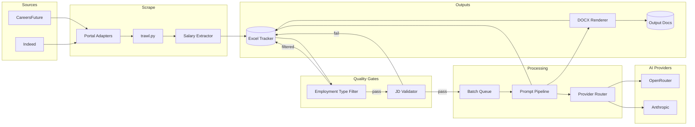
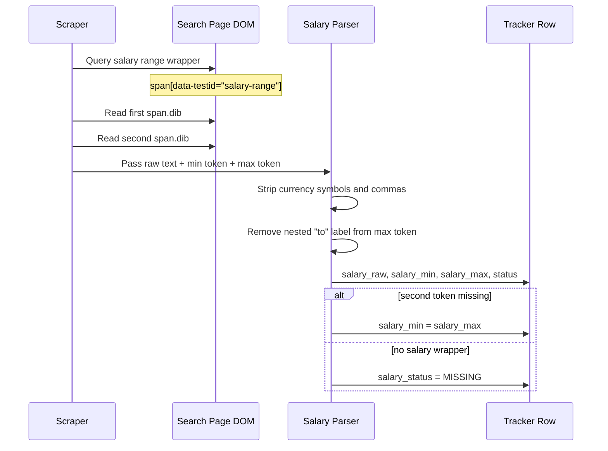
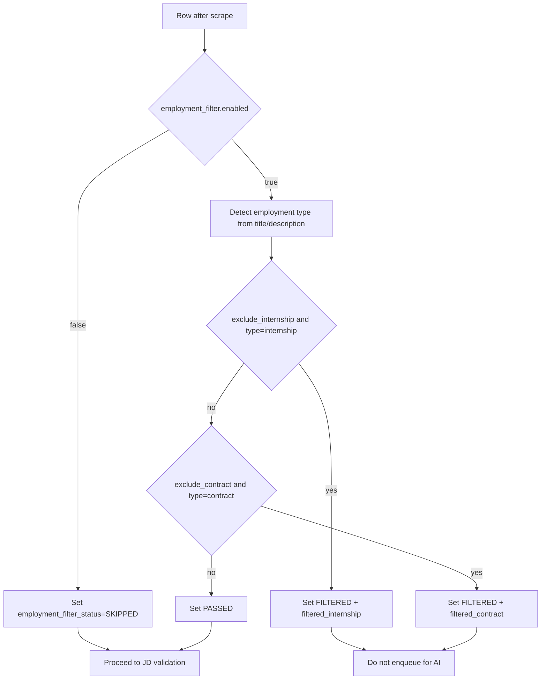
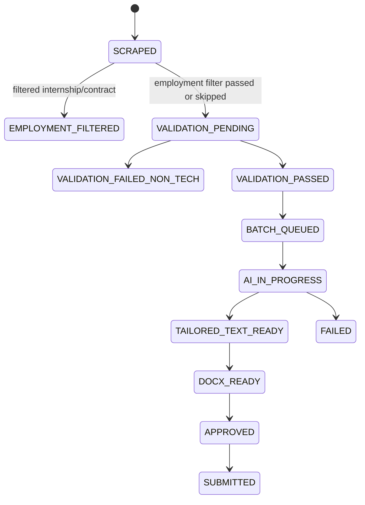
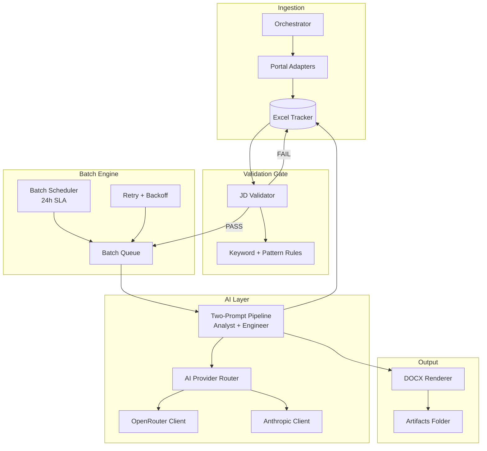

# Architecture Design: Job Application Automation (Updated)

## 1. Goals of This Update

This architecture revision introduces seven capabilities:

1. Salary extraction with explicit selector-driven parsing for CareersFuture.
2. Toggleable employment-type filtering for internship and contract roles.
3. Automatic pass/fail validation for technical relevance before AI tailoring.
4. Slow, controlled batch processing with a 24-hour service-level target.
5. AI provider abstraction for OpenRouter and Claude with budget controls.
6. Two prompt layers for role-specific curation (Data Analyst and Data Engineer).
7. Downstream output generation in DOCX format.

## 2. Diagram-First Architecture Plan

### 2.1 End-to-End System Context



### 2.2 Salary Extraction Sequence (CareersFuture)



### 2.3 Employment Filter Decision Flow



### 2.4 Processing and State Transitions



## 3. High-Level Target Architecture



## 4. Runtime Pipeline and States

### 4.1 End-to-End Flow

1. Scrape listing and description using existing adapters.
2. Persist raw row to Excel with initial state `SCRAPED`.
3. Run employment-type filter stage (if enabled).
4. Run JD Validator gate using role profile derived per row.
5. If failed, mark row `VALIDATION_FAILED_NON_TECH` and skip AI.
6. If passed, enqueue row into batch queue for role-specific prompt processing.
7. Execute two-prompt pipeline for selected role stream.
8. Save tailored text in tracker and render DOCX artifact.
9. Mark row `DOCX_READY` only after post-write validation succeeds.

### 4.2 Tracker State Model (Extended)

Recommended status lifecycle:

- `SCRAPED`
- `VALIDATION_PENDING`
- `VALIDATION_FAILED_NON_TECH`
- `VALIDATION_PASSED`
- `BATCH_QUEUED`
- `AI_IN_PROGRESS`
- `TAILORED_TEXT_READY`
- `DOCX_GENERATION_FAILED`
- `DOCX_READY`
- `APPROVED`
- `SUBMITTED`
- `FAILED`

## 5. Component Design Changes

### 5.1 JD Validator (New)

Add `job_automation/ai/jd_validator.py`:

- Input: `raw_description`, `role`, optional `portal_name`.
- Output: `ValidationResult(pass_fail, score, matched_keywords, fail_reasons)`.
- Logic:
  - Positive technical keyword packs per stream (Analyst, Engineer).
  - Negative/flag patterns for suspected sales/insurance bait descriptions.
  - Minimum threshold rule (for example: at least N technical hits).
  - Role profile selected from row title/role metadata (not a single global default role).

Rule packs should be externalized in `config.yaml` so tuning does not require code deploy.

### 5.2 Salary Extractor (New)

Add extractor logic in `job_automation/trawl.py` and adapter-level helpers where available.

Selector-specific extraction contract for CareersFuture:

- Range wrapper: `span[data-testid="salary-range"]`
- Min element: first `span.dib` inside wrapper
- Max element: second `span.dib` inside wrapper

Output mapping:

- `salary_raw`: full wrapper text
- `salary_min`: numeric value from first element
- `salary_max`: numeric value from second element (after stripping `to`)
- `salary_status`: `OK | MISSING | AMBIGUOUS | ERROR | SKIPPED`

Fallback rules:

- If only first element is available, set `salary_min=salary_max`.
- If wrapper missing, set `salary_status=MISSING`.

### 5.3 Employment Filter Stage (New)

Add toggle-driven filter ahead of technical validation.

Config-driven behavior:

- `employment_filter.enabled`
- `employment_filter.exclude_internship`
- `employment_filter.exclude_contract`
- `employment_filter.unknown_policy`

Decision output:

- `employment_type_normalized`
- `employment_filter_status`
- `employment_filter_reason`

### 5.4 Batch Engine (New)

Add `job_automation/core/batch_processor.py`:

- Selects jobs in `VALIDATION_PASSED` state.
- Slices into configurable batch sizes.
- Processes gradually based on target throughput window (24h).
- Applies retry policy with capped retries and exponential backoff.

Scheduling policy:

- Keep orchestrator scraping loop separate from AI batch execution.
- Execute batch worker at a fixed interval and compute throughput target as:
  $$\text{jobs per hour} = \frac{\text{queued jobs}}{24}$$
- Emit SLA drift warning when projected completion exceeds configured SLA window.

### 5.5 AI Provider Router (Refactor)

Replace direct Gemini dependence with interface-driven provider clients:

- New abstract base: `job_automation/ai/providers/base.py`
- OpenRouter client: `job_automation/ai/providers/openrouter_client.py`
- Anthropic direct client: `job_automation/ai/providers/anthropic_client.py`
- Router/fallback: `job_automation/ai/provider_router.py`

Key requirements:

- Hard budget ceiling from config.
- Request-level cost estimation and cumulative spend tracking.
- Fail closed when daily or monthly cap is reached.
- Optional provider fallback order.
- Locking strategy must support Windows and POSIX (no POSIX-only import/runtime assumptions).
- Persist reservation lifecycle metadata to tracker (`reservation_id`, expiry, reserved cost, actual cost).

### 5.6 Two-Prompt Pipeline (Refactor)

Expand `job_automation/ai/prompts.py` and add `job_automation/ai/pipeline.py`:

- `ANALYST_SYSTEM_PROMPT`, `ANALYST_USER_TEMPLATE`
- `ENGINEER_SYSTEM_PROMPT`, `ENGINEER_USER_TEMPLATE`

Routing modes:

- `role_hint`: use configured role target from search role list.
- `classifier`: lightweight classification from title/JD.
- `dual_run`: run both prompts and keep better-scored result (optional, more cost).

Implementation rule:

- Active mode must be read from config (`ai.pipeline_mode`) to keep behavior deterministic and tunable.

Quality scoring can start with deterministic rules (keyword coverage, banned fabrication checks) before adding LLM-as-judge.

### 5.7 DOCX Renderer (New)

Add `job_automation/output/docx_renderer.py` using `python-docx`:

- Input: tailored plain text + metadata.
- Output: `.docx` file under `job_automation/output/docs/{job_id}.docx`.
- Optional template path for stable formatting.
- Persist generated path in tracker for apply step.
- Retain failed temp files only inside retention window, then clean by scheduled cleanup call.

## 6. Configuration Model Changes

Extend `job_automation/config.yaml` with:

- `ai.provider`: `openrouter` or `anthropic`
- `ai.fallback_order`: ordered list
- `ai.budget`: `daily_cap_usd`, `monthly_cap_usd`, `hard_stop: true`
- `ai.pipeline_mode`: `role_hint | classifier | dual_run`
- `validation.role_source`: `row_role | global_default`
- `batch`: `enabled`, `interval_minutes`, `batch_size`, `target_sla_hours`
- `salary`: parser defaults and selector mapping per portal
- `employment_filter`: enabled flag and internship/contract toggles
- `validation`: keyword dictionaries, thresholds, deny patterns
- `output`: docx template path and output directory

## 7. Data and Filesystem Impacts

### 7.1 Tracker Columns (Recommended additions)

- `validation_score`
- `validation_reason`
- `ai_provider_used`
- `pipeline_track`
- `docx_path`
- `reservation_id`
- `reservation_expires_at`
- `cost_reserved_usd`
- `cost_actual_usd`
- `cost_usd`
- `processed_at`
- `salary_raw`
- `salary_min`
- `salary_max`
- `salary_currency`
- `salary_period`
- `salary_status`
- `employment_type_raw`
- `employment_type_normalized`
- `employment_filter_status`
- `employment_filter_reason`

### 7.2 Artifact Layout

```text
job_automation/
├── output/
│   ├── docs/
│   │   └── <job_id>.docx
│   └── logs/
│       └── ai_costs_YYYYMMDD.csv
```

## 8. Reliability and Guardrails

1. Validator-first design prevents wasting API budget on low-quality listings.
2. Batch queue isolates transient provider failures from scraping.
3. Budget hard stop prevents unbounded spend.
4. DOCX output is deterministic and reviewable before submission.
5. Existing restart loop in `main.py` remains valid and now resumes using richer states.
6. Selector-specific salary extraction reduces parsing ambiguity and improves testability.
7. Tracker metadata includes reservation lifecycle fields for budget audits and replay diagnosis.
8. Portability requirement: budget-ledger path must run on Windows and POSIX with equivalent semantics.

## 9. Security and Compliance

- Keep API keys in environment variables or secret store only.
- Log only truncated JD excerpts in error traces to reduce sensitive exposure.
- Store cost and audit data locally for budget verification.
- Do not persist provider raw responses beyond required text output and troubleshooting metadata.
